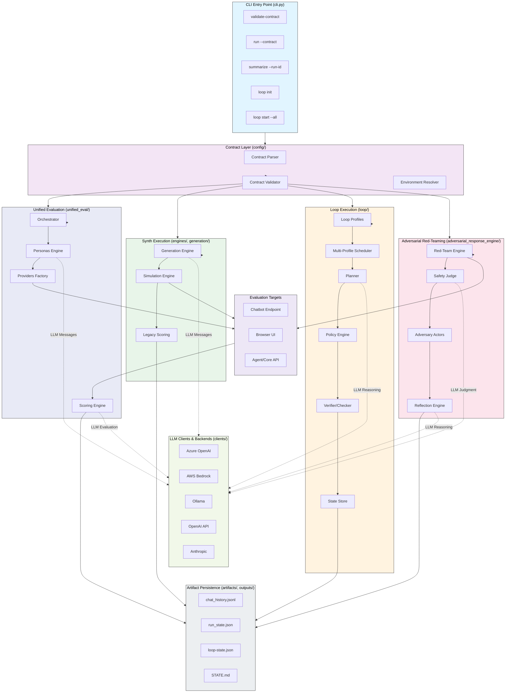

# Adversarial Adaptive Synthetic Evaluation

A Python CLI tool for generating synthetic multi-turn chat histories and performing adversarial red-teaming to evaluate HR policy chatbots. This local-first, contract-driven simulation engine creates realistic conversation data without requiring production telemetry or external dependencies.

## 🎯 Overview

Adversarial Adaptive Synthetic Eval helps you:
- **Generate realistic test data**: Create thousands of diverse, persona-driven conversations.
- **Test chatbot behavior**: Validate responses across different user types, scenarios, and edge cases.
- **Inject failures**: Simulate ambiguous queries, typos, frustration, and policy boundary pressure.
- **Evaluate at scale**: Run concurrent simulations with configurable traffic patterns.
- **Red-team chatbots**: Perform adversarial red-teaming to uncover vulnerabilities.
- **Run continuous loops**: Autonomously discover evaluation targets, apply constrained recoveries, and run unattended with safety guardrails (L1/L2/L3 readiness levels).

---

## 🏗️ Architecture



---

## 📋 Table of Contents

- [Setup](#setup)
- [Quick Start](#quick-start)
- [Detailed Documentation](#detailed-documentation)
- [Project Structure](#project-structure)
- [Testing](#testing)

---

## Setup

### Prerequisites

1. **Python 3.11+**
2. **uv package manager** (recommended)

#### Install uv

```bash
# macOS/Linux
curl -LsSf https://astral.sh/uv/install.sh | sh

# Alternative via pip
pip install uv
```

### Project Setup

1. Copy the example environment file and configure your settings:
   ```bash
   cp src/.env.example src/.env
   ```
2. Edit `src/.env` and fill in your API keys and endpoints.
3. Install package and local dependencies:
   ```bash
   uv sync
   ```

To make the `ase` command available globally in your workspace without prefixing `uv run`, run:
```bash
uv tool install --editable .
```

---

## Quick Start

### 1. Validate a Contract

```bash
uv run ase validate-contract contracts/examples/unified_evaluation_demo.yaml
```

### 2. Run a Dry-Run Simulation

Test your contract without making real chatbot API calls:

```bash
uv run ase run --contract contracts/examples/unified_evaluation_demo.yaml --dry-run
```

### 3. Stream Realtime Chat

Watch conversations unfold live in your terminal with interactive controls (speed up, pause, switch personas, alter user styles):

```bash
uv run ase run --contract contracts/examples/unified_evaluation_demo.yaml --dry-run --realtime-chat
```

If a previous run with the same `run_id` was interrupted, choose recovery behavior explicitly:

```bash
# Continue remaining conversations from checkpoint state
uv run ase run --contract contracts/examples/unified_evaluation_demo.yaml --incomplete-run-action resume

# Start over and clean prior artifacts for that run_id
uv run ase run --contract contracts/examples/unified_evaluation_demo.yaml --incomplete-run-action restart
```

### 4. Summarize a Run

```bash
uv run ase summarize --run-id unified_evaluation_demo_run
```

---

## Detailed Documentation

Detailed guides covering all components and configuration reference are available in the [docs/](./docs) directory:

- [**Simulation Contracts Guide**](./docs/contracts.md): Complete schema reference for YAML contracts, personas, scenarios, traffic patterns, and validation.
- [**CLI Usage & Commands Guide**](./docs/cli_usage.md): Reference for `ase` commands, arguments, interactive real-time controllers, and corporate proxy/SSL configuration.
- [**LLM User Simulation Guide**](./docs/user_simulation_llm.md): Dynamic message generation setup utilizing Azure OpenAI, Ollama, Anthropic, or OpenAI.
- [**Unified & Adversarial Evaluation**](./docs/unified_evaluation.md): Red-teaming and safety testing with adaptive planners, safety judges, and schedules.
- [**Adversarial Agent Walkthrough**](./docs/adversarial_agent_walkthrough.md): Technical deep-dive walkthrough of the adaptive adversarial red-teaming engine, actors, and algorithms.
- [**Persona Memory System**](./docs/persona_memory.md): isolated, markdown-based memory tracking that evolves across conversation sessions.
- [**Output Schema & Artifacts**](./docs/output_artifacts.md): Folder structures and detailed column definitions for output `chat_history` files.
- [**Loop Engineering**](./docs/loop_engineering_for_adversarial_adaptive_synthetic_evaluation.md): Continuous evaluation loops with AI-driven discovery, assisted actions, and unattended execution (L0–L3).
- [**Loop Operations Runbook**](./docs/loop_operations_runbook.md): Production operations guide for unattended loop scheduling, kill switches, and recovery.

---

## Project Structure

```text
adaptive-synth-eval/
├── contracts/
│   └── examples/                  # Example YAML contracts and test configs
├── docs/                          # User guides, architecture notes, and runbooks
│   └── trajectory_aware_adaptive_eval_harness/
├── examples/                      # Small runnable demo scripts
├── loops/
│   └── profiles/                  # Continuous evaluation loop profiles
├── outputs/
│   └── runs/                      # Generated run artifacts (one folder per run_id)
├── src/
│   └── adaptive_synth_eval/       # Main package
│       ├── adversarial_response_engine/
│       ├── artifacts/
│       ├── clients/
│       ├── config/
│       ├── engines/
│       ├── evaluation/
│       ├── generation/
│       ├── loop/
│       ├── scoring/
│       └── unified_eval/
└── tests/
    ├── integration/               # End-to-end and CLI workflow tests
    └── unit/                      # Component and utility tests
```

---

## Testing

Run the test suite using pytest:
```bash
uv run pytest
```
