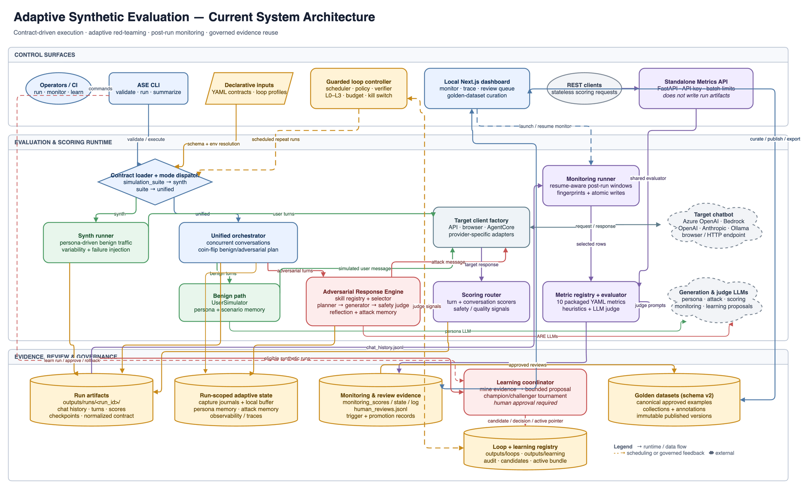

# Adversarial Adaptive Synthetic Evaluation

## Product overview

Adversarial Adaptive Synthetic Evaluation (ASE) is a contract-driven Python CLI for testing HR policy chatbots without relying on production traffic. It generates realistic multi-turn conversations, mixes benign and adversarial behavior, scores target responses, and writes reproducible artifacts for analysis and monitoring.

## Capabilities

- Generate persona-driven synthetic conversations with configurable scenarios, traffic, and failure injection.
- Run unified evaluations that interleave benign turns with adaptive adversarial probes.
- Plan adversarial turns with opt-in, curated Agent Skills packages and bounded read-only helper tools.
- Exercise API, browser, and AWS Bedrock AgentCore targets.
- Score response quality and safety, then persist machine-readable and human-readable artifacts.
- Re-evaluate existing run artifacts for monitoring and review them in a local dashboard.
- Serve the packaged metric catalog and evaluate independent payload tuples through an authenticated Python API.
- Coordinate repeat evaluations with guarded L0-L3 loop profiles, budgets, and kill switches.

## Quick start

### Prerequisites

- Python 3.11 or later
- [`uv`](https://docs.astral.sh/uv/) for dependency and environment management

Install `uv` if needed:

```bash
curl -LsSf https://astral.sh/uv/install.sh | sh
```

Alternatively, install it with `pip install uv`.

### Set up the project

```bash
cp src/.env.example src/.env
uv sync
```

Add provider credentials and endpoints to `src/.env` before making live model or target calls. To make `ase` available outside `uv run`, optionally install the project as a tool:

```bash
uv tool install --editable .
```

### Validate and dry-run an evaluation

```bash
uv run ase validate-contract contracts/examples/unified_evaluation_demo.yaml
uv run ase run --contract contracts/examples/unified_evaluation_demo.yaml --dry-run
```

The dry-run exercises the workflow without real LLM or target calls. To watch the generated conversation in the terminal:

```bash
uv run ase run --contract contracts/examples/unified_evaluation_demo.yaml --dry-run --realtime-chat
```

Copy the run ID printed by `ase run`, then summarize that completed run:

```bash
uv run ase summarize --run-id <printed_run_id>
```

For recovery flags, realtime controls, and the full command reference, see the [CLI guide](docs/cli_usage.md).

## Choose an evaluation workflow

| Goal | Workflow | Start with |
| --- | --- | --- |
| Generate realistic benign traffic | `synth` mode | [User simulation](docs/user_simulation_llm.md) and [contracts](docs/contracts.md) |
| Mix benign traffic with safety probes | `unified` mode | [Unified evaluation](docs/unified_evaluation.md) |
| Understand or extend adaptive attacks | Adversarial response engine | [Adversarial agent walkthrough](docs/adversarial_agent_walkthrough.md) |
| Author or operate standard attack methods | Agent Skills attack methods | [Attack skills](docs/attack_skills.md) |
| Re-score completed run artifacts | Monitoring | [Monitoring guide](docs/monitoring.md) |
| Score independent payloads over REST | Metrics API | [Standalone metrics API](docs/metrics_api.md) |
| Schedule guarded repeat evaluations | Loop execution | [Loop architecture](docs/loop_engineering_for_adversarial_adaptive_synthetic_evaluation.md) and [operations runbook](docs/loop_operations_runbook.md) |

Contracts auto-select the execution mode: top-level `simulation_suite` selects `synth`, while top-level `suite` selects `unified`.

## Standalone metrics API

Set a service API key plus one supported judge-provider configuration, then launch the Python server:

```bash
export ASE_METRICS_API_KEY="replace-with-a-secret"
uv run ase metrics serve --host 127.0.0.1 --port 8000 --workers 1
```

The service exposes the ten packaged YAML specifications and stateless single or batch evaluation. It does not use the dashboard Node server or write run artifacts. See the [standalone metrics API guide](docs/metrics_api.md) for endpoints, request examples, provider requirements, and concurrency controls.

## Compact architecture

[](docs/architecture/adaptive-synth-eval-architecture.drawio)

The [editable draw.io source](docs/architecture/adaptive-synth-eval-architecture.drawio) separates control surfaces, runtime execution, external providers, and governed evidence flows. The CLI parses and validates contracts, dispatches synth or unified execution, invokes the configured target, and stores run-scoped results under `outputs/runs/<run_id>/`. Unified runs combine benign persona simulation with the adversarial response engine and shared scoring.

Monitoring incrementally evaluates persisted chat history for the file-backed dashboard and human review workflow. Approved reviews can become versioned golden datasets, while eligible synthetic runs feed the bounded champion/challenger learning workflow. Guarded loops apply approved bundles only at run boundaries. The standalone Metrics API reuses the metric registry and evaluator but remains outside the run-artifact and dashboard process boundary.

## Dashboard

The local Next.js dashboard reads run and monitoring artifacts from `outputs/runs/`.

```bash
cd ai-eval-dashboard
yarn install
yarn dev
```

Open [http://localhost:3000](http://localhost:3000). See the [dashboard setup guide](ai-eval-dashboard/README.md) for dashboard commands and the [monitoring guide](docs/monitoring.md) for producing and maintaining monitoring results.

## Documentation map

Use the [documentation hub](docs/README.md) to find the right guide by task and audience. It routes new users through contracts and CLI basics, evaluators through synth and unified workflows, analysts through artifacts and the dashboard, and operators through monitoring and continuous loops.

## Project structure

```text
adaptive-synth-eval/
├── ai-eval-dashboard/           # Local monitoring and review dashboard
├── contracts/examples/          # Runnable synth and unified contracts
├── docs/                        # Guides, architecture notes, and runbooks
├── loops/profiles/              # Continuous-evaluation profiles
├── outputs/runs/                # Artifacts grouped by run_id
├── src/adaptive_synth_eval/
│   ├── adversarial_response_engine/
│   ├── clients/                 # Target and model backends
│   ├── config/                  # Synth contract schema and parsing
│   ├── engines/                 # Synth execution
│   ├── loop/                    # Repeat-run coordination and safeguards
│   ├── monitoring/              # Post-run monitoring evaluation
│   └── unified_eval/            # Unified orchestration and scoring
└── tests/
    ├── integration/
    └── unit/
```

## Development and testing

Run the complete test suite:

```bash
uv run pytest
```

Run a narrower suite while developing:

```bash
uv run pytest tests/unit/
uv run pytest tests/integration/
uv run pytest -k "test_name_pattern"
```

Validate CLI wiring without executing an evaluation:

```bash
uv run ase --help
uv run ase run --help
```
