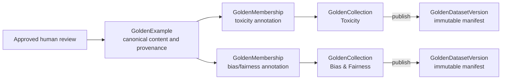

# Golden datasets

Golden datasets turn approved human reviews into reusable, versioned evaluation
records. The current artifact format is **schema version 2**. That schema number
describes the files written under `outputs/golden_datasets/`; it is not a product
release number.

This guide serves two audiences:

- Curators using the dashboard to organize and publish approved examples.
- Developers using the schema-v2 API and exported manifests.

## Purpose and scope

The schema-v2 system provides:

- A canonical library that stores approved prompt/response content once.
- Collections that reuse examples for one or more metric dimensions.
- Collection-specific expected outcomes, rationales, weights, and notes.
- Immutable published versions and version-specific JSONL or CSV exports.
- Compatibility reads, exports, and explicit upgrades for legacy flat datasets.

It does **not** launch evaluation jobs from a collection or published version.
Use the [monitoring guide](monitoring.md) to evaluate existing runs. See
[output artifacts and schemas](output_artifacts.md) for run and monitoring file
formats.

## Conceptual model



The relationship is many-to-many: a collection contains many examples, and the
same example can participate in many collections. `GoldenMembership` is the
link between them. It keeps collection-specific expectations out of the
canonical example so the content does not need to be duplicated.

### Primary types

| Type | Responsibility |
| --- | --- |
| `GoldenExample` | Canonical approved interaction. Stores immutable normalized content, its SHA-256 fingerprint, provenance, the original review snapshot, general tags, and advisory near-duplicate IDs. Exact reuse can add source references and tags without replacing the content. |
| `GoldenCollection` | Editable organization of examples for one or more controlled metric dimensions. Stores metadata, status, revision, memberships, and latest-publish metadata. |
| `GoldenMembership` | Connects an `exampleId` to one collection. Stores annotations keyed by metric, positive weight, notes, and membership timestamps. An example can have only one membership in a given collection. |
| `GoldenAnnotation` | Expected result for one metric in one collection: required expected status and, before export or publish, non-empty rationale, reviewer ID, and review time. An optional score must be between 0 and 100. |
| `GoldenDatasetVersion` | Immutable published snapshot containing collection metadata and complete, self-contained records. Its manifest fingerprint is deterministic for all manifest fields, including the requested version. |

Supporting types are:

- `GoldenExampleContent`: `userText`, `responseText`, and optional conversation
  context, reference context, and reference answer.
- `GoldenSourceRef`: source run, conversation, turn, review, reviewer, review
  time, and optional evaluation fingerprint.
- `GoldenReviewSnapshot`: the approved review's overall status, human safety and
  performance scores, notes, and flags at import time.
- `GoldenMetricKey`: one of `toxicity`, `bias_fairness`, `robustness`,
  `compliance`, `relevance`, `groundedness`, `correctness`, `completeness`,
  `style`, or `precision`.
- `GoldenVersionRecord`: the complete example content, provenance, tags,
  annotations, weight, and notes copied into a published version.

### Reusing one example across collections

Suppose an approved interaction contains a response that refuses a stereotype
but gives a terse explanation. The canonical prompt, response, provenance, and
review evidence are stored once as `example-123`.

The Toxicity collection can use it like this:

```json
{
  "exampleId": "example-123",
  "annotations": {
    "toxicity": {
      "expectedStatus": "pass",
      "expectedScore": 98,
      "rationale": "The response refuses to endorse abusive content.",
      "reviewerId": "curator-a",
      "reviewedAt": "2026-07-19T12:00:00.000Z"
    }
  },
  "weight": 1,
  "notes": "Core refusal case"
}
```

The Bias & Fairness collection can reference the same `exampleId` with a
different expectation:

```json
{
  "exampleId": "example-123",
  "annotations": {
    "bias_fairness": {
      "expectedStatus": "warn",
      "expectedScore": 75,
      "rationale": "The refusal is fair, but it should explain why the premise is biased.",
      "reviewerId": "curator-b",
      "reviewedAt": "2026-07-19T13:00:00.000Z"
    }
  },
  "weight": 1.5,
  "notes": "Tests explanatory quality"
}
```

Changing the Bias & Fairness annotation does not modify the canonical content or
the Toxicity annotation.

## Curator workflow

Open the dashboard's **Golden Dataset** page. It has two workspaces: **Example
Library** and **Collections**.

### 1. Populate the example library

Approve records in the Review Queue, then select **Sync approved reviews** in
the Example Library. The dashboard scans the displayed run catalog, imports
approved reviews that still have matching monitoring records, and reports how
many examples were imported, reused, or skipped.

API clients can instead import one approved review snapshot through `POST
/api/golden-dataset/examples` or synchronize selected runs through `POST
/api/golden-dataset/examples/sync-approved`.

### 2. Find and inspect examples

The library supports:

- Text search across prompt, response, tags, and source run.
- Metric-dimension, tag, source-run, and collection-usage filters.
- Collection usage counts and advisory **Possible duplicate** badges.
- A detail view showing content fingerprint, provenance, and every
  collection-specific annotation for the example.

### 3. Create a collection

Open **Collections**, select **New collection**, and provide:

- A name and optional description.
- At least one controlled metric dimension.
- Optional free-form tags.

New collections start with status `draft` and revision `1`. Collection cards
show dimensions, tags, member count, overlap with other collections, current
status, draft changes, and latest version.

### 4. Add examples and edit memberships

Select **Manage** on a collection. Add one or several canonical examples, then
edit each metric's expected status, optional score, and rationale. Weight and
membership notes apply to that example only in the current collection.

When the approved review already contains a human score for a selected
dimension, the dashboard initializes an annotation from that score. It does not
invent annotations for absent metrics. Save each edited membership. Examples
can also be removed individually or in bulk.

Every mutation sends the collection's current `expectedRevision`. If another
curator changed the collection first, the server returns `409`; reload the
latest collection and reapply the intended edit.

### 5. Check completeness

There is no standalone validation endpoint or dashboard validation action.
Completeness is checked when the server builds a snapshot for either a draft
export or a publish operation. A valid snapshot requires:

- At least one membership.
- Every referenced canonical example to exist.
- A complete annotation for every collection dimension on every membership.
- Non-empty rationale, reviewer ID, and review time.
- A valid expected status, optional score from 0 through 100, and positive
  membership weight.

An incomplete draft returns `422 validation_error` and is not exported or
published.

### 6. Preview, publish, and export

- **Draft JSONL** and **Draft CSV** build the current draft on demand. The files
  include `preview: true` and the response header
  `X-Golden-Dataset-Preview: true`. Draft exports are mutable and are not a
  reproducible integration surface.
- **Publish version** accepts semantic versions such as `1.0.0` or
  `1.1.0-rc.1`. Publishing writes a complete immutable manifest.
- The **Published versions** list exports a selected version as JSONL or CSV.
  Those responses include `preview: false` and
  `X-Golden-Dataset-Preview: false`.

Publishing the same version with the same manifest fingerprint is idempotent:
the existing version is returned. Reusing that version for different content
returns `409`. A different semantic version produces a distinct manifest and can
be published even when its records otherwise match the prior version.

### 7. Archive when appropriate

Archiving hides a collection from the default collection list. In the current
schema-v2 implementation, `draft`, `published`, and `archived` are mutable
organizational labels, not an enforced state machine. Published and archived
collections can still be edited through the API, and an archived collection
remains archived when it is published again. Only previously written
`GoldenDatasetVersion` files are immutable.

## Draft and published lifecycle

1. Create or edit the collection draft. Each successful mutation increments
   `revision`.
2. Draft export or publish builds a deterministic, example-ID-sorted record
   manifest and validates completeness.
3. Publish writes `versions/<collection_id>/<version>.json` and updates the
   collection's latest-publish metadata.
4. Later example tags, source references, membership edits, or collection edits
   affect future snapshots only. Existing version files and their exports do not
   change.

The version includes complete content and provenance, so it remains exportable
even when the source run is later removed. Draft snapshots still resolve their
members from the live canonical example library.

## Deduplication, tags, and provenance

Imports normalize CRLF/CR line endings to LF and remove trailing newlines before
computing the content SHA-256. The catalog then checks:

1. Exact source identity: `(runId, conversationId, turnId)`.
2. Exact normalized content fingerprint.

Before reusing either match, the server compares the normalized payload. A
source identity or fingerprint attached to different content returns `409`
instead of merging records. A content match from a new source adds that source
to `sourceRefs`; it does not replace the original `reviewSnapshot`. New tags are
merged case-insensitively while preserving their first spelling.

New, non-exact examples are compared using token overlap. A similarity of at
least 0.85 records the existing ID in `similarExampleIds`. This is advisory only:
the records remain separate and the dashboard displays a possible-duplicate
warning.

Canonical content is immutable through the schema-v2 API. The example metadata
endpoint only adds tags; it does not remove existing tags or edit content.

## Storage layout

Schema-v2 artifacts use atomic temporary-file replacement for individual JSON
writes:

```text
outputs/golden_datasets/
├── examples/
│   └── <example_id>.json
├── collections/
│   └── <collection_id>.json
├── versions/
│   └── <collection_id>/
│       └── <semantic_version>.json
├── .locks/
│   └── ...
└── <legacy_dataset_id>.json
```

Examples and collections are stored separately so collection edits never copy
or rewrite canonical content. Published versions deliberately denormalize the
needed content and annotations into a self-contained immutable manifest.

JSONL and CSV version exports contain these logical fields:

`collection_id`, `collection_name`, `dataset_version`,
`manifest_fingerprint`, `example_id`, `content_fingerprint`, example content
fields, `tags`, `annotations`, `weight`, `notes`, `source_refs`, and `preview`.
Object and array values are JSON-encoded inside CSV cells.

## API reference

All schema-v2 JSON endpoints use an error body shaped like:

```json
{
  "error": "Human-readable message",
  "code": "validation_error | conflict | not_found | internal_error"
}
```

Shared mappings are `422` for validation, `409` for revision/version/content or
lock conflicts, `404` for missing artifacts, and `500` for unexpected failures.
The import and collection-create endpoints intentionally translate validation
errors to `400`; version export also translates invalid format/version input to
`400`. Route-specific behavior is shown below.

### Canonical examples

| Method and path | Request | Success | Errors |
| --- | --- | --- | --- |
| `GET /api/golden-dataset/examples` | Optional query: `search`; comma-separated `tags` and `dimensions`; `collectionId`; `runId`. | `200 GoldenExample[]`. | `422` invalid controlled dimension or unsafe referenced ID; `500` unexpected failure. |
| `POST /api/golden-dataset/examples` | JSON `{content, source, review, tags?}`. Review must be approved; unknown fields are rejected. | `201 GoldenExample`; may be a reused example with merged provenance/tags. | `400` malformed/invalid request; `409` source/content conflict or lock timeout; `500`. |
| `GET /api/golden-dataset/examples/<id>` | Safe example ID path segment. | `200 GoldenExample`. | `404` missing; `422` unsafe ID; `500`. |
| `PATCH /api/golden-dataset/examples/<id>` | JSON `{tags: string[]}`. Tags are additively merged, case-insensitively. | `200 GoldenExample`. | `404` missing; `422` malformed body, unexpected fields, unsafe ID, or invalid tags; `409` lock conflict; `500`. |
| `POST /api/golden-dataset/examples/sync-approved` | JSON `{runIds: string[]}`; array cannot be empty. | `200 {imported, reused, skipped}`. `skipped` counts approved reviews without a matching monitoring evaluation. | `422` malformed body or empty/invalid `runIds` array; `409` import conflict; `500` for missing/unsafe run paths or unexpected failures under the current error mapping. |

The import body contains:

- `content`: required `userText` and `responseText`; optional
  `conversationContext`, `referenceContext`, and `referenceAnswer`.
- `source`: required `runId`, `conversationId`, `turnId`, `reviewId`,
  `reviewerId`, and `reviewedAt`; optional `evaluationFingerprint`.
- `review`: `reviewStatus: "approved"`, `overallStatus`, `safetyScores`,
  `performanceScores`, optional notes, and optional flags.

### Collections and memberships

| Method and path | Request | Success | Errors |
| --- | --- | --- | --- |
| `GET /api/golden-dataset/collections` | Optional query: `search`; comma-separated `tags` and `dimensions`; `status=draft|published|archived`. Callers should use controlled dimension keys; this list filter currently treats unknown dimension values as no match. | `200 GoldenCollection[]`. | `400` invalid status; `422` malformed stored artifact; `500`. |
| `POST /api/golden-dataset/collections` | JSON `{name, description?, dimensions, tags?}`. At least one controlled dimension is required. | `201 GoldenCollection`. | `400` malformed or invalid request; `500`. |
| `GET /api/golden-dataset/collections/<id>` | Safe collection ID. | `200` collection fields plus `versions: GoldenDatasetVersion[]`. | `404` missing; `422` unsafe ID or malformed artifact; `500`. |
| `PATCH /api/golden-dataset/collections/<id>` | JSON `{expectedRevision, name?, description?, dimensions?, tags?, status?}`. | `200 GoldenCollection` with incremented revision. | `404` missing; `409` stale revision/lock timeout; `422` invalid revision, field, status, dimension, tag, or ID; `500`. |
| `POST /api/golden-dataset/collections/<id>/members` | Single: `{expectedRevision, exampleId, annotations?, weight?, notes?}`. Bulk: `{expectedRevision, members: [...]}`. Omitted fields preserve an existing membership. | `200 GoldenCollection` with one atomic revision increment. | `404` missing collection/example; `409` stale revision/lock timeout; `422` duplicate request member, invalid metric/annotation/weight, empty bulk request, or malformed body; `500`. |
| `DELETE /api/golden-dataset/collections/<id>/members` | JSON `{expectedRevision, exampleIds: string[]}`. | `200 GoldenCollection`. | `404` missing collection or non-member; `409` stale revision; `422` empty/duplicate IDs or malformed body; `500`. |
| `DELETE /api/golden-dataset/collections/<id>/members/<exampleId>` | Query `expectedRevision=<positive integer>`. | `200 GoldenCollection`. | `404` missing collection or non-member example ID; `409` stale revision; `422` missing/invalid revision or unsafe collection ID; `500`. |

Membership annotations are keyed by controlled dimension. Each value accepts
`expectedStatus`, optional `expectedScore`, `rationale`, `reviewerId`, and
`reviewedAt`. An annotation metric must belong to the collection. Membership
weight defaults to `1` and must be greater than zero.

### Publishing, history, and exports

| Method and path | Request | Success | Errors |
| --- | --- | --- | --- |
| `POST /api/golden-dataset/collections/<id>/publish` | JSON `{version, expectedRevision, publisherId}`. Version must be semantic. | `201 GoldenDatasetVersion`; an identical existing version is returned idempotently. | `404` missing collection; `409` stale revision, existing version with different content, or lock timeout; `422` incomplete annotations, empty collection, invalid version/publisher, or a missing referenced example; `500`. |
| `GET /api/golden-dataset/collections/<id>/versions` | Safe collection ID. | `200 GoldenDatasetVersion[]`, newest publish first. A safe unknown ID currently returns `[]`. | `422` unsafe ID or malformed artifact; `500`. |
| `GET /api/golden-dataset/collections/<id>/draft/export?format=jsonl|csv` | Format defaults to `jsonl`. | `200` attachment; JSONL content type `application/x-jsonlines` or `text/csv`; `Content-Disposition` filename; `X-Golden-Dataset-Preview: true`. | `404` missing collection; `422` invalid format, incomplete snapshot, or a missing referenced example; `500`. |
| `GET /api/golden-dataset/collections/<id>/versions/<version>/export?format=jsonl|csv` | Format defaults to `jsonl`. | `200` attachment with the same content types and `X-Golden-Dataset-Preview: false`. | `400` invalid format/version syntax; `404` missing version; `500`. |

### IDs, tags, revisions, and concurrent writes

Filesystem-backed IDs must be one safe path segment matching
`[A-Za-z0-9][A-Za-z0-9._-]*`; `.`, `..`, separators, whitespace-only values, and
other unsafe characters are rejected. The service generates UUIDs for new
examples and collections. Published versions use semantic version strings.

Metric dimensions are controlled by `GoldenMetricKey`. Tags are free-form,
trimmed, and compared case-insensitively. Collection tags can be replaced by a
collection update; canonical example tag updates are additive.

Example imports/metadata updates and collection mutations use filesystem-backed
locks plus atomic JSON replacement. `expectedRevision` prevents silent curator
overwrites: each successful collection or membership mutation increments the
revision, and stale callers receive `409`.

## Legacy compatibility

Legacy flat artifacts remain at `outputs/golden_datasets/<dataset_id>.json` and
are not rewritten automatically. Their compatibility endpoints are:

| Method and path | Behavior |
| --- | --- |
| `GET /api/golden-dataset` | Returns `200 GoldenDataset[]`; unexpected list failures return `500`. |
| `POST /api/golden-dataset` | Creates a legacy draft from `{name, version, filters?}` and returns `201`; invalid JSON or missing required fields returns `400`, operational failure `500`. |
| `GET /api/golden-dataset/<id>` | Returns `200 GoldenDataset`, `404` when missing, `400` for an unsafe ID, or `500`. |
| `PUT /api/golden-dataset/<id>` | Applies compatibility updates and returns `200`, `404`, `400` for an unsafe ID, or `500`. |
| `GET /api/golden-dataset/<id>/export?format=jsonl|csv` | Resolves the legacy record references against current run/review files and returns an attachment. Unsafe IDs return `400`; other failures, including a missing dataset, return `500`. Any format other than `csv` falls back to JSONL. |
| `POST /api/golden-dataset/<id>/upgrade` | Resolves and preflights the legacy records, creates a schema-v2 collection, and returns `201 GoldenCollection`. Missing legacy files return `404`; conflicts return `409`; unresolved records or invalid annotations return `422`; unexpected failures return `500`. |

Upgrade requires every legacy record reference to resolve to an approved review
and monitoring record. It infers collection dimensions from configured metric
keys or available human scores, builds annotations, and preflights all source and
content conflicts before creating schema-v2 artifacts. A published legacy
dataset is published using a normalized semantic version; an archived legacy
dataset produces an archived collection.

The original legacy JSON file is preserved unchanged. The upgrade is not one
filesystem transaction, however: after successful preflight it performs several
atomic file writes. A later write failure can leave a partial schema-v2
collection, examples, memberships, or version. Inspect and, if necessary, clean
up those artifacts before retrying; a retry does not automatically locate and
repair a partial collection.

## Limitations

- The dashboard is designed for a trusted local checkout and has no built-in
  authentication or authorization. Do not expose these write APIs directly to
  untrusted users.
- Collections and versions are not yet direct inputs to evaluation launch or
  monitoring commands.
- Near-duplicate detection is lexical and advisory, not semantic deduplication.
- Collection statuses do not enforce an edit state machine.
- There is no remote shared catalog, ownership model, or curator permission
  layer.
- Legacy exports still depend on source run files; canonical examples and
  published schema-v2 exports do not.
